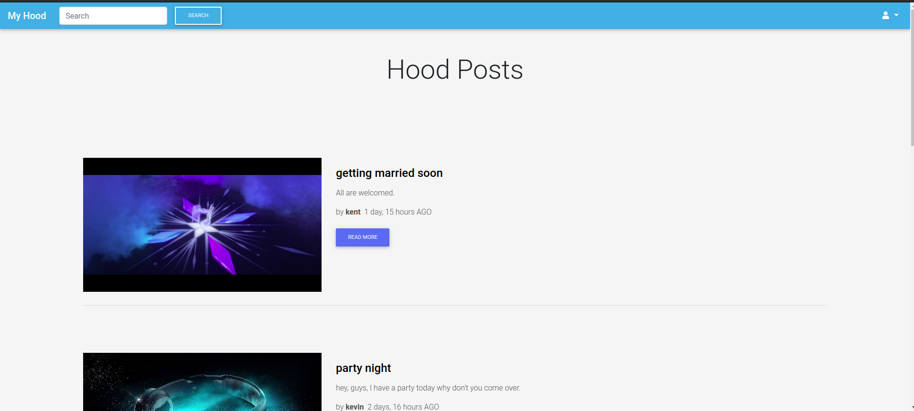
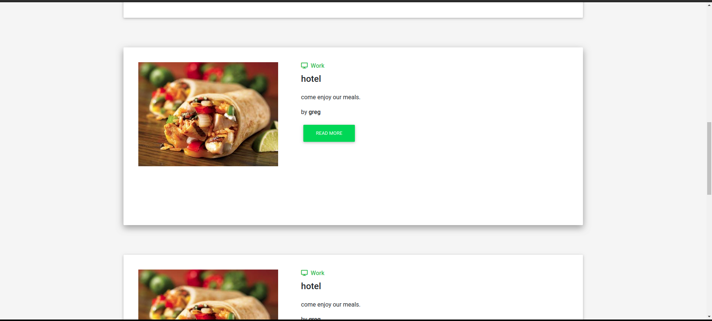
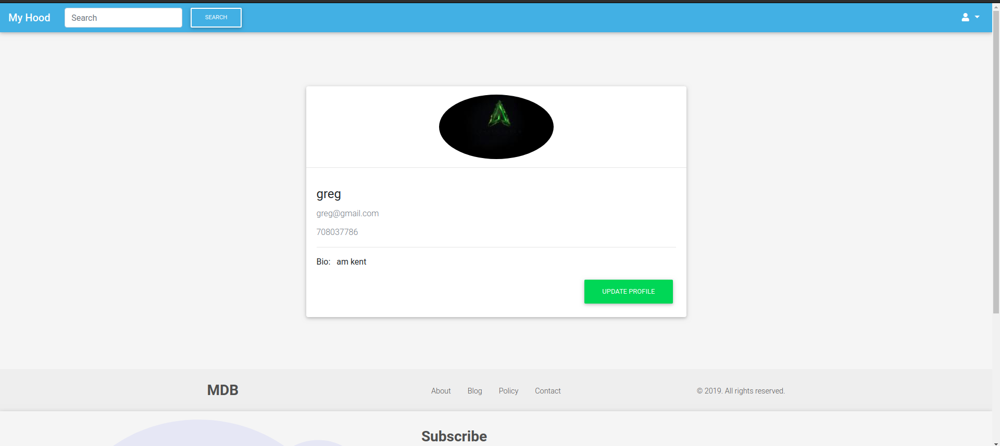
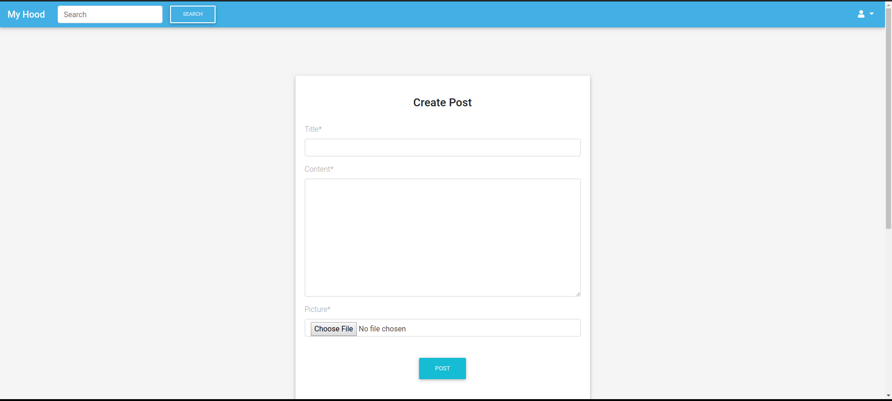
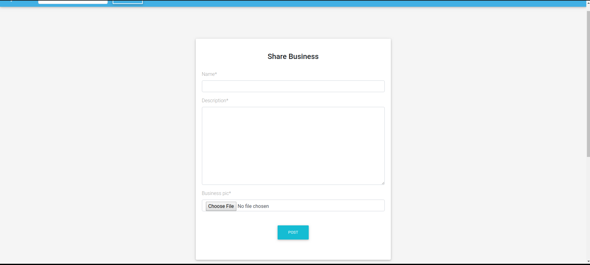

# THE HOOD

## Project Author
> **NAME :** Kenneth Ochieng Joseph

## Screenshots
> **Visual presentation of my work**
 >>##### Landing page

 >>##### business

 >>##### search

>>##### profile

>>##### post

>>##### create businness 

 ## Description
>

## Who it serves
> This platform serves web developers willing to share there work with others and have them rated for them to know the level of thee work portraid by others
## Access the site
> To access the website, click on the link provided here;
>[Myport](https://awards-kent.herokuapp.com/)

## Technologies Used
>The following are the list of technology used
 - HTML
 - CSS
 - Bootstrap 4
 - Mdbootrap
 - Javascript and JQuery
 - Django
 - Postgresql Database

## Note
> the above project is still under development quite a number of functionalities aren't in place yet and ass functional as planned but will be soon enough
 ## Contact me
 > To contact me please call this number : 0708037786

 ## License
  MIT License

Copyright (c) 2019 Kenneth Ochieng Joseph

Permission is hereby granted me Kenneth Ochieng Joseph the deveeloper of this site, free of charge, to any person obtaining a copy
of this software and associated documentation files (the "MY PORTFOLIO"), to deal
in the Software without restriction, including without limitation the rights
to use, copy, modify, merge, publish, distribute, sublicense, and/or sell
copies of the Software, and to permit persons to whom the Software is
furnished to do so, subject to the following conditions:

The above copyright notice and this permission notice shall be included in all
copies or substantial portions of the Software.

THE SOFTWARE IS PROVIDED "AS IS", WITHOUT WARRANTY OF ANY KIND, EXPRESS OR
IMPLIED, INCLUDING BUT NOT LIMITED TO THE WARRANTIES OF MERCHANTABILITY,
FITNESS FOR A PARTICULAR PURPOSE AND NONINFRINGEMENT. IN NO EVENT SHALL THE
AUTHORS OR COPYRIGHT HOLDERS BE LIABLE FOR ANY CLAIM, DAMAGES OR OTHER
LIABILITY, WHETHER IN AN ACTION OF CONTRACT, TORT OR OTHERWISE, ARISING FROM,
OUT OF OR IN CONNECTION WITH THE SOFTWARE OR THE USE OR OTHER DEALINGS IN THE
SOFTWARE. 